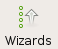
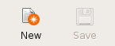
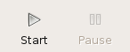
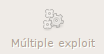
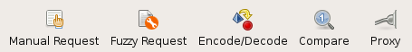

General structure
=================

In this section the general structure of the w3af graphical user interface is
explained. The following is the main window, the first image that you'll see
from the system after it's completely loaded (during the load you'll see a
splash image that gives you information about how the system is loading):
 
 .. image:: images/general-structure.png
   :scale: 35 %                                   
   :alt: GUI screenshot
   :align: center

In the image you can see different sections. On top, as usual there's the menu
[1] and the toolbar [2]. The body of the window is separated in different
notebook tabs [3]. At the bottom of the window you have the the toolbar [4]
and an indicator about the found elements [5]. In the notebook tab that you
can see at the program beginning, there are three vertical panes: the profiles [6],
the plugin selector [7], and the plugin configuration area [8] (where so far you
see the w3af icon because you didn't select any plugin yet). Above them you also
have the target URL [9].

The toolbar
-----------

The toolbar is separated in different functional groupings. The first button
opens the Point and Click Penetration Test, that is a Wizard that allows you to
create profiles in an easy way, without having specific security related
knowledge.

The second and third buttons, New and Save, operate on the Profiles. New will
create a new Profile, and for this the system will ask you the profile name and
a description, be creative! If you change a profile, you also can save the
modifications it to disk, using the second button.

The third and fourth buttons, Play and Pause, control the state of the working
Core. These buttons are mutable, as change over time, look the next section (Running
the scan) for a deeper explanation of how these buttons behave.

The sixth button is to trigger Multiple Exploits. It will be enabled only in
the Exploits window, check that part of the documentation for a more detailed
information about this.

The rest of the buttons are to open and use different tools. Check the
:doc:`tools` section of the documentation for an explanation of the different
tools.

Finally, at the very right, there's a throbber that shows when the Core is
working or not.

