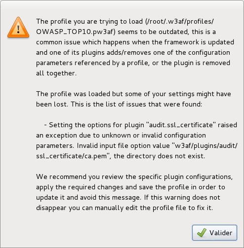

Bug reporting
=============

The framework is under continuous development and we might introduce bugs and
regressions while trying to implement new features. We use continuous integration
and heavy unit and integration testing to avoid most of these but some simply
reach to our users (doh!)

Good bug reporting practices
----------------------------

If you're using **the latest version of the framework** and find a bug, please
`report it <https://github.com/andresriancho/w3af/issues/new>`_ including the
following information:

 * Detailed steps to reproduce it
 * Expected and obtained output
 * Python traceback (if exists)
 * Output of the ``./w3af_console --version`` command
 * Log file with verbose set to ``True`` (see below)

When reporting installation bugs and issues that might relate to your environment,
it is a good idea to include `detailed system information <https://gist.githubusercontent.com/andresriancho/9873639/raw/adaff04e2ffe95dfd0b0069a294297107249f7b3/collect-sysinfo.py>`_.

.. code-block:: none

	user@box:~/w3af$ wget http://goo.gl/eXpPDl -O collect-sysinfo.py
	user@box:~/w3af$ chmod +x collect-sysinfo.py
	user@box:~/w3af$ ./collect-sysinfo.py

This will generate a file called ``/tmp/w3af-sysinfo.txt`` which you may include
in your bug report.

Making sure you're on the latest version
~~~~~~~~~~~~~~~~~~~~~~~~~~~~~~~~~~~~~~~~

``w3af`` is usually installed in two different ways by our users:

 * ``apt-get install w3af`` (or similar)
 * ``git clone git@github.com:andresriancho/w3af.git``

Installing using the Operating System package manager is the easiest way, but
will usually install an old version of the software that won't be able to :doc:`update.rst`.
For reporting bugs we recommend you install the latest ``w3af`` from our repository.

Cloning from the git repository into a directory in your home is the recommended
way and will allow auto-updates which guarantee you're always using the latest
and greatest.

Getting the specific ``w3af`` version is easy using the ``--version`` command line argument:

.. code-block:: none

	user@box:~/w3af$ ./w3af_console --version
	w3af - Web Application Attack and Audit Framework
	Version: 1.5
	Revision: 4d66c2040d - 17 Mar 2014 21:17
	Branch: master
	Local changes: Yes
	Author: Andres Riancho and the w3af team.
	user@box:~/w3af$ 

The output of the command is simple to understand, but lets go through it just in case:

 * ``Version: 1.5``: The w3af version number
 * ``Revision: 4d66c2040d - 17 Mar 2014 21:17``: If this line is present you've installed ``w3af`` by cloning from our repository. ``4d66c2040d`` is the SHA1 ID of the latest ``git`` commit your system knows about.
 * ``Branch: master``: The ``git`` branch your installation is running from. In most cases this should be one of ``master`` or ``develop``.
 * ``Local changes: Yes``: Indicates if you've manually modified ``w3af``'s source code

Just to make sure you're on the latest version run ``git pull`` inside the ``w3af`` directory making sure that ``Already up-to-date.`` appears:

.. code-block:: none

	user@box:~/w3af$ git pull
	Already up-to-date.

Now you're ready to report a bug!

Basic debugging
---------------

When you want to know what the framework is doing the best way is to enable the
``text_file`` output plugin, making sure that the ``verbose`` configuration
setting set to ``true``. This will generate a very detailed output file which
can be used to gain an insight on ``w3af``'s internals.

.. code-block:: none

    plugins
    output text_file
    output config text_file
    set verbose True
    back

False negatives
---------------

If ``w3af`` is failing to identify a vulnerability which you manually verified
please make sure that:

 * The ``audit`` plugin that identifies that vulnerability is enabled
 * Using basic debugging, make sure that ``w3af`` finds the URL and parameter
   associated with the vulnerability. If you don't see that in the log, make
   sure the ``crawl.web_spider`` plugin is enabled.

False negatives should be `reported just like bugs <https://github.com/andresriancho/w3af/issues/new>`_ , including all the same information.

False positives
---------------

Nobody likes false positives, you go from the adrenaline of "The site is
vulnerable to SQL injection!" to "Nope, false positive" in less than a minute.
Not good for your heart.

Please report the false positives `like bugs <https://github.com/andresriancho/w3af/issues/new>`_ ,
in our repository. Include as much information as possible, remember that we'll
have to verify the false positive, write a unittest and then fix it.

Common problems
---------------

After many years of `w3af` development we've found some common problems that, while
not a bug, annoy our users and are common enough to include in this section.

Outdated profiles
-----------------

One of those issues appears when the user migrates from an old `w3af` version to a new one,
and the `profiles` stored in the user directory are incompatible with the latest version.
`w3af` will try to open the old profile and fail, users will see something like:

The error is self explanatory: "The profile you are trying to load is outdated", but
lacks some "quick actions" that the user can perform to avoid seeing this error. If you
don't care about the old profiles just:

.. code-block:: none

	user@box:~/$ rm -rf ~/.w3af/profiles/

The next time `w3af` is run, it will copy the default profiles to the user's home directory.

For users that really care about the profiles which are in the old version, I recommend you
migrate them manually using these steps:

 * Backup your profiles
 * Remove them from the home directory (`~/.w3af/profiles/`)
 * Open the profile to migrate using a text editor
 * Open `w3af` and create a new plugin
 * Save the newly created plugin

